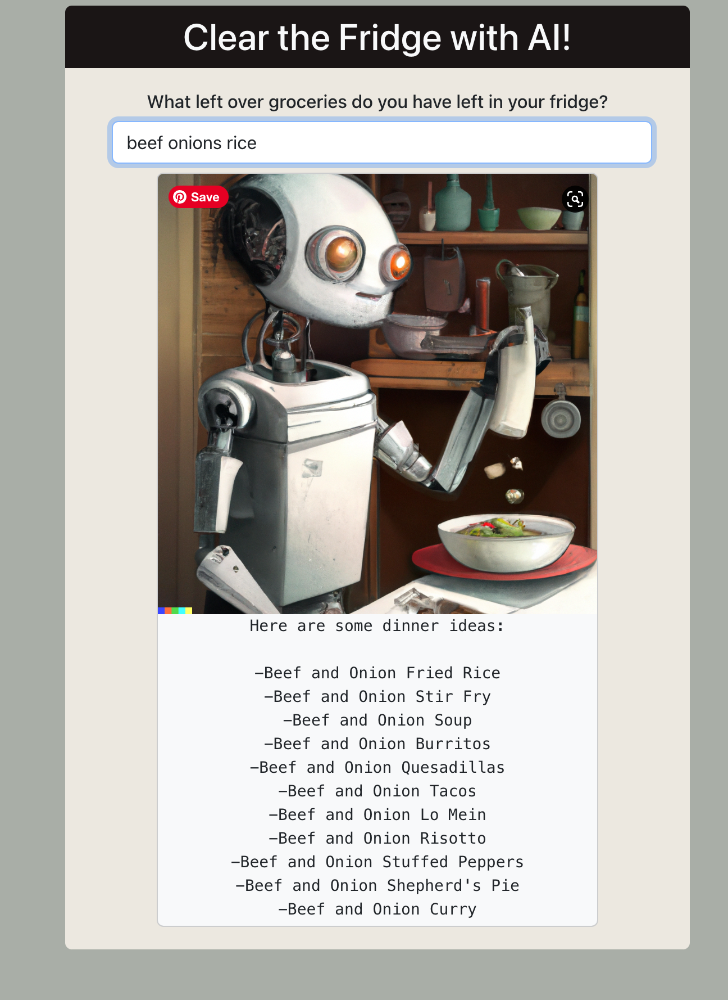

# ChowGPT API App

An AI-Power API Application to generate dinner recipe ideas based on what ingredients users have left over in their fridge.

Try it out <a href=https://helpful-chatbot.onrender.com/>here</a>.

<b>Summary</b>

This full-stack API application allows users to utilize the power of OpenAi's GPT-3 to generate dinner recipe ideas based on what the user has left over in their fridge.

This project was my second full-stack application to interact with API data. It is very exciting as a developer to only recently develop the skills necessary to take advantage and

It took me some time to wrap my head around how data moves from back-end to front-end and how to best send and receive it but it's been a very exciting process building something from scratch and trying to get your data from the console to being nicely formated and displayed on the page.

<b>Author</b>

<ul><b>Andy Wang</b> - <i>Full-Stack Software Developer - </i><a href=https://www.linkedin.com/in/andy-wang-wreckcreation>LinkedIn</a>
